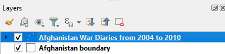
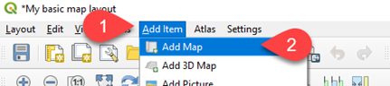
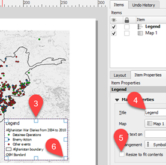
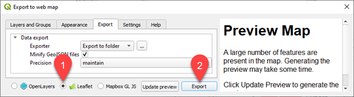

# How to create a basic map for print and web using QGIS

By Dr Godwin Yeboah, IDG Technology for Research, Client Experience, Information & Digital Group (IDG), University of Warwick, UK.

## 1. Learning goals and requirements

### 1.1 Learning outcomes
By the end of this tutorial, participants should be able to

- Know how to use different visual cartographic techniques to effectively present outcomes of data exploration in QGIS
- Understand and use some functions in QGIS and QuickOSM plugin
  - Know how to use QGIS to create a basic map for presentation/publication
  - Learn how to download data from OpenStreetMap and visualise in QGIS
  - Learn how to load data into QGIS and visualise
  - Know how to use a QuickOSM plug in QGIS
- Learn how to export your data using qgis2web plugin and generate an interactive web map and visualise using a browser. 

### 1.2 Requirements
- Good internet connection throughout the workshop session
- Access to a computer with internet connection
- Properly installed [Quantum GIS software version 3.22](https://www.qgis.org/en/site/forusers/download.html) (See Section 2 below).
- Data sources for this tutorial 
  - Afghanistan War Diaries data
     - [Afghan War Diaries](https://wikileaks.org/afg/), a released document by Wikileaks in 2010, is “an extraordinary compendium of over 91,000 reports covering the war in Afghanistan from 2004 to 2010. The reports, while written by soldiers and intelligence officers, and mainly describing lethal military actions involving the United States military, also include intelligence information, reports of meetings with political figures, and related details.” 
     - The data has been geocoded which is the process in which text (e.g., street addresses) are converted into geographic coordinates (e.g., longitude and latitude).
     - You will download the data here (you may need to login using you University of Warwick account): <https://github.com/spatialscientist/How-to-create-a-map-for-print-and-web-using-QGIS/blob/main/AfghanWarDiary_EnemiesDetained.csv> 
     - Disclaimer: The Afghan War Diaries data was taken directly from “[Tutorial for Data Literacy: space](https://moodle.warwick.ac.uk/mod/book/view.php?id=1041120&chapterid=116557)” course on Moodle and not from Wikileaks website.
  - OpenStreetMap data
     - [OpenStreetMap](https://www.openstreetmap.org/) (OSM) is a free editable map of world created by people like you. It is free to use under an [open license](https://www.openstreetmap.org/copyright). 
     - As a demonstration of how to extract data from this resource, this tutorial will show how to extract the [country boundary of Afghanistan](https://www.openstreetmap.org/relation/303427#map=6/33.257/67.379) in QGIS. 

## 2. How to install QGIS 3.22 (if not already done!)

- If you don’t have QGIS already, open your web browser - this may be Firefox, Chrome, Opera, or Internet Explorer.
- Go to the following website: <https://qgis.org/en/site/forusers/download.html> 
  - Windows users: download “[QGIS Standalone Installer Version 3.22](https://qgis.org/downloads/QGIS-OSGeo4W-3.22.0-3.msi)”
  - Mac users: download “[QGIS macOS Installer Version 3.22](https://qgis.org/downloads/macos/qgis-macos-pr.dmg)”
  - If you are using managed desktop, please install via *Software Center* or request via [helpdesk](https://warwick.ac.uk/services/its/servicessupport/helpdesk/).
- The website should look like something below where you have options to choose your operating system (e.g., Windows, Mac OS, Linux, etc.):

	

- Look for “QGIS Standalone Installer Version 3.22” on [the website](https://www.qgis.org/en/site/forusers/download.html) and download to your computer. 
  - This version was released on 30.10.2021 and is also referred to as ' Białowieża ' with the aim of supporting the celebration of 100-year anniversary of [Białowieża National Park in Poland](https://qgisbialowieza.pl/). 
  - Note where you downloaded the file. For example, if you are using Windows Microsoft Edge to download, you can click on the “Open” button to start the installation or “Save as” button to save the file in a specific folder.
  
	

	- If you downloaded the file in a specific folder, locate where the file is downloaded, double click the file, and follow the instructions to install QGIS 3.22.

## 3. Brief overview of QGIS 3.22
- Quantum GIS 3.22 is a free and open-source geographical information system. This means it can be used and developed further freely.
- Start GIS 3.22 in Windows or Mac per your installation.
- The first time you open QGIS 3.22 software, the interface might look like pointing you to some news items and showing an empty list of recent projects (see image below). 

	
	
## 4. Installation of plugins in QGIS 3.22

- QGIS plugins are additional tools to the core QGIS software which provide additional functionality. First, let us list the proposed plugins to be installed (the list of plugin names to fetch/search): 
  - QuickOSM (For extracting data from OpenStreetMap (OSM) database) 
  - QGIS2WEB (For generating interactive maps in browsers)
  - QuickMapServices (For loading online basemaps like Google map or OSM.)
- To download and install QGIS 3.22 plugins, go to **Plugins > Manage and Install Plugins…** from the menu bar

	 

- Search for QuickOSM, select it from the list, and click Install plugin button. **HINT:** Be mindful of the logo for the plugin. You will need it for a quick start of the program in the Toolbars area.

	 

- **Note only (Do nothing here)**: You can start QuickOSM from several locations depending on how your operating system configures the installation. Thus, direct from the Toolbar or via ***Vector*** ***QuickOSM*** ***QuickOSM…***

	 

- **CHALLENGE 1**: Use your experience from installing QuickOSM plugin to install the following two plugins: **QGIS2WEB** and **QuickMapServices**.

## 5. Setup your QGIS project and folder
- **Warning**: Your folder location should be directly at your drive to avoid long path problems. For example, it could be like: **C:\qgis\_tutorial\**
- Save your empty “Untitled” project in a newly created as “**my\_qgis\_project**”. Go to Menu bar  Project  Save  Select folder  Type name of your project file and save 

	

- Download the Afghanistan War Diaries data using the following link: [Afghanistan War Diaries data](https://github.com/spatialscientist/How-to-create-a-map-for-print-and-web-using-QGIS/blob/main/AfghanWarDiary_EnemiesDetained.csv)
- Make sure the downloaded file is saved or copied to your “qgis\_tutorial” project folder.
- Let’s make it easier to always go to your project folder inside QGIS by adding the project folder to as favourite. Go to Browser panel  Right click “qgis\_tutorial” folder  Add as a Favourite.

	
	
## 6. Creating a basic map for print
Our objective is to create a basic map based on the Afghanistan War Diaries data. You will use *QuickOSM plugin* to extract country boundary of Afghanistan from the OpenStreetMap.org database. You will also use OpenStreetMap as a basemap for your map.

### Step 1: Loading the Afghanistan war diaries data 

- Open your empty project file created earlier above by double-clicking on the file, if it is closed. There are so many ways of opening existing qgis project. You can open files directly using open folder icon in toolbars area, Project  Open…, via Favorites, or double click project file. 

	
	
	

- Add the diaries data as a delimited text layer. Note that the file itself is in a delimited text format. Go to Menu bar Layer  Add Layer  Add Delimited Text Layer…  Select diaries data file and look for the longitude and latitude files to select.

	
	
	

- **WELL DONE!** You have been able to import your diaries data into QGIS!
- Save you project. Make sure you save your project often to avoid losing any of your work.
- Save (or export) the layer as **Afghanistan War Diaries from 2004 to 2010** using **.geojson file format**. This step is important because the current layer is still seen by QGIS as delimited text layer and the layer is linked to the raw data which can make it difficult to edit the layer. Go to layer Right-click layer Export Feature As…

	
	
	

- Remove the “AfghanWarDiary\_EnemiesDetained “ layer. Go to layer Right-click layer Remove Layer…Ok button

	

- Create a symbology for different events which occurred in the diary. 
	- Go to layer properties. Go to layer Right-click layer Properties. You can also double click layer.

	

	- Categorize the different types of events using random colours.

	

	- You can reshuffle the random colours.

	

	- You can also double click each categorized layer and change the colour manually.

	

- **Note**: It is important to always save your project from time to time to avoid losing all the work you have done so far!

### Step 2: Extract and add country boundary of Afghanistan
- First, let’s explore the tags given to Afghanistan country boundary in OpenStreetMap database. Open your internet browser [I am using Microsoft Edge browser] Type OpenStreetMap.org Search Afghanistan Click “Country Afghanistan” in the results. 

	

	**IMPORTANT**. Observe the “**alt\_name:af | Afganistan**"; we will use the tag in next step. In QGIS, this will be used as “**Key | Value**" in QuickOSM dialog. If you are finding problem understanding this, you can go to the final OpenStreetMap page [here](https://www.openstreetmap.org/relation/303427#map=5/33.651/68.335).

- Start QuickOSM plugin. You will need to accept copyrights.

	|

- Enter the parameters below, including the tags in the Step 2 (a) above, and run query to extract the country boundary. Thus, **Key** column is “**alt\_name:af”**, **Value** column is “**Afganistan**”, and make sure “**Canvas Extent**” is selected in Step 4 below.

	

- Save “**alt\_name:af\_Afganistan []**” layer as “**Afghanistan boundary”** in .geojson file format. 

	 

- Remove all layers with names “**alt\_name:af\_Afganistan”**. We no longer need them and we don’t have to save them. Highlight the three layers (i.e., polygons, lines, and point layers) Right-click the highlighted area Remove Layer…

	

- Go to the layer properties of “**Afghanistan boundary”** layer.

	

- Change symbology so that you can see only black outline of the boundary. 

	

- Save your project file by going to Project Save.

- Move “Afghanistan War Diaries from 2004 to 2010” layer to the first on the list of layers. Click and hold the layer using the mouse and move the top of the layers. 

	

	Layers should finally look like the following below.

	

- If not already the case, try and zoom the extent of the boundary so that you can see the full spatial extent of Afghanistan country boundary.

	

- **WELL DONE**! You have added the boundary layer/data to your project! Save project.

### Step 3: Add OpenStreetMap as a basemap

- Add OpenStreetMap as a basemap to your project using the installed **QuickMapServices** plugin.

	

- Render the basemap using a grayscale (By lightness). Go to **OSM Standard** layer  Symbology  Grayscale (By lightness).

	

- **WELL DONE**! You have added OpenStreetMap basemap to your project! Save project.

### Step 4: Prepare you map using layout manager

QGIS has an inbuilt tool called &quot;Layout Manager&quot; which can be used to produce quality maps containing all the basic cartographic requirements of a map such as Title, Legend, Scale, North Arrow. Let&#39;s get started! Almost there!

In creating a map, it is important to think about what you want to show on the map. In our example here, the types of events are regrouped into three: **Detainee Operations** ; **Enemy Action** ; and, **Other** events.

- Go to layer properties of &quot;Afghanistan War Diaries from 2004 to 2010&quot;  Move &quot;Detainee Operations&quot; and &quot;Enemy Action&quot; layers to first two layers  Merge all remaining layers as Other.

	

- Change merged layers Legend label to &quot;Other&quot; and change colours of the layers.

	

- Delete &quot;all other values&quot; layer.

	

- Save project!
- Click on the Project  Layout Manager menu entries to open this tool. You&#39;ll see a blank Layout Manager dialog appear. Click on Create button, enter your layout name as &quot; **My basic map layout**&quot;.

	 

- The layout window for composing the map will show. We will not explore all the functions here, just the basics to get our map!
- Add your map to the layout by selecting &quot;Add Item  Add Map&quot; and click and drag a box on the blank white page. Don&#39;t worry, you can move the map around later by clicking and dragging it.

	

- You will see map item added and item properties also added to help with further settings if you want. Once you add other items, the Items list will show it.

	

- Add Legend by going to Add Map  Add Legend. Place it at the bottom-right side of the map. Make sure you enter the title &quot;Legend&quot; in the Item Properties. Also make sure you check &quot;Only show items inside the linked map&quot;.

	)

- Save your layout!
- Add Item  Add North Arrow. Place it at the top right corner and resize it.

	

- Add Item  Add Scale Bar. Place it below the map but in line with the legend and map bottom edge.

	

### Step 5: Export map as a pdf

- Map is ready! We can export as a pdf (and other file formats)!
- Export composed map as image file format .jpeg by going to Layout  Export as Image… Save file as &quot;C:\qgis\_tutorial\ **My basic map of Afghanistan war diaries from 2004 to 2010**.pdf&quot; in project folder. Keep PDF Export Options defaults and click save button.

	 

- **Well done! We have achieved our objective of creating a basic map for print.**

## 7. Creating a basic map as an interactive web map

Our objective is to use QGIS2WEB plugin to create a basic interactive web map based on the Afghanistan War Diaries data.

- Start QGIS2WEB plugin.

	 

- Select some few options in addition to the default selections and export the map as a web map which will show in your default browser. Go to Layers and Groups and select Cluster.

	 

- Select Appearance dialog and do some selections

	 

- Select your project folder as the place to export the folder containing all the files created by the QGIS2WEB plugin so that you can locate them.

	 

- Create your interactive web map by selecting Leaflet and clicking Export button

	 

- **WELL DONE!** You should see the interactive web map opened in your browser!

## 8. Examples of hosting the interactive map or embedding in a web page online

You can even host your interactive web map online as a full web page or embedded.

- See example of using GitHub pages [HERE](https://spatialscientist.github.io/qgis2webgithub).
- See example of using a full web page [HERE](https://datno.lnx.warwick.ac.uk/qgis2web/index.html) (_Note that this server is only accessible on Warwick campus at the time of the workshop or via VPN_). I put it in the &quot;…/data/www/html&quot; folder.
- See example of embedding the map in a web page [HERE](https://datno.lnx.warwick.ac.uk/qgis2web/embed_example.html) (_Note that this server is only accessible on Warwick campus at the time of the workshop or via VPN_). Right-click page and select inspect to see html code; I used HTML _iframe_ tag.

